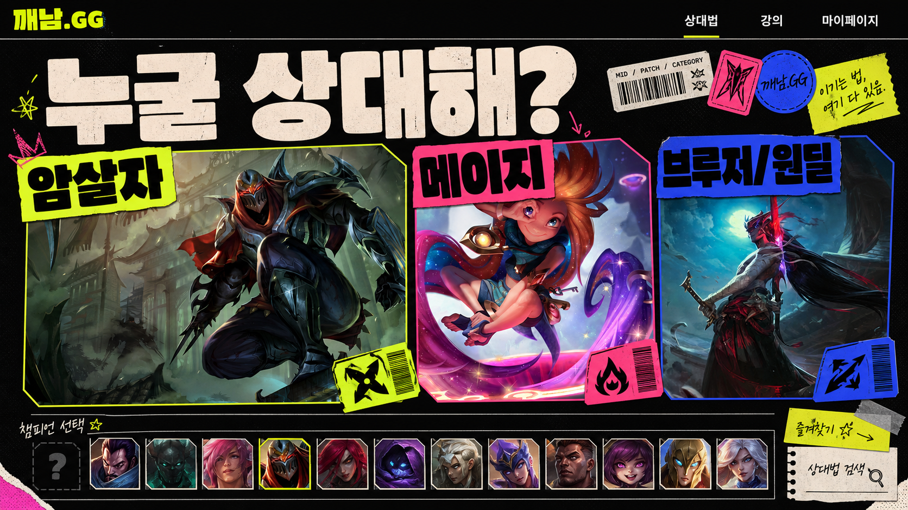
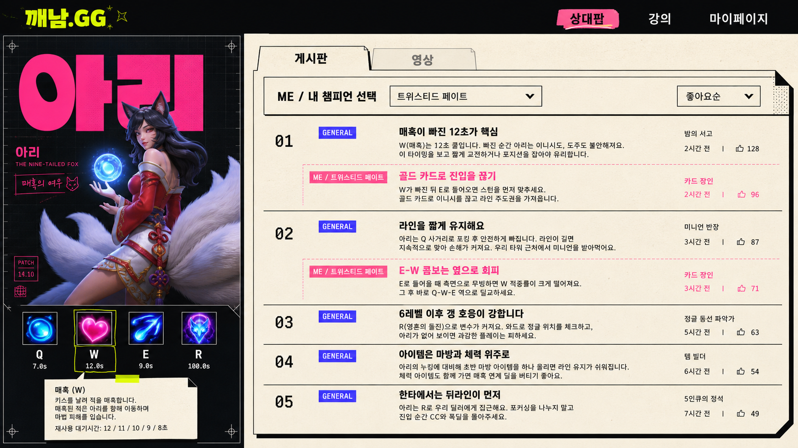

# 깨남.GG Visual Design Blueprint

| 항목 | 내용 |
| --- | --- |
| 문서 버전 | v0.2 |
| 기준 문서 | `PRD.md` v0.3 |
| 승인 상태 | **개발 시각 기준 확정 (2026-08-31)** |
| 콘셉트명 | **GLOWING MATCHUP ZINE — 야광 상대법 잡지** |
| 핵심 인상 | 게임 공략 잡지, PC방 스티커 보드, 형광펜 메모, 실험적인 한국어 에디토리얼 디자인 |

## 1. 디자인 선언

깨남.GG는 일반적인 게임 통계 대시보드처럼 보여서는 안 된다. 이 사이트는 사용자가 게임 직전에 펼쳐 보는 살아 있는 공략 잡지에 가깝다. 화면의 정보 구조는 빠르고 명확하게 유지하되, 비대칭 편집 그리드, 강한 한글 타이포그래피, 잘라 붙인 이미지, 형광펜 표시를 사용해 고유한 인상을 만든다.

다음 세 문장을 모든 디자인 판단의 기준으로 삼는다.

1. **챔피언은 카드 안의 썸네일이 아니라 한 장의 포스터다.**
2. **General은 인쇄된 본문이고, Me는 나중에 덧칠한 형광펜 메모다.**
3. **3D와 모션은 정보를 돕는 무대 장치이며 콘텐츠보다 앞에 나오지 않는다.**

### 1.1 확정된 개발 방향

사용자가 생성된 두 시각 목업과 이 문서의 디자인 방향을 승인했다. 이후 UI 구현과 확장은 다음 우선순위를 기본값으로 삼는다.

1. 기능 범위와 사용자 흐름은 `PRD.md`를 따른다.
2. 시각적 판단은 이 문서와 `design/blueprints/category-selection-v1.png`, `design/blueprints/ahri-matchup-v1.png`를 기준으로 삼는다.
3. 목업의 픽셀이나 임시 문구를 그대로 복제하기보다 비대칭 편집 구조, STATIC BLOOM 색 체계, 강한 한글 타이포그래피, 포스터·스티커·형광펜 문법과 정보 위계를 보존한다.
4. 새 화면과 컴포넌트도 같은 잡지의 다음 페이지처럼 느껴져야 하며, 범용 SaaS 대시보드나 둥근 카드 템플릿으로 회귀하지 않는다.
5. 반응형 사용성, 접근성, 성능, 실제 데이터와 에셋 사용 권리를 위해 필요한 조정은 허용하되 시각적 의도를 유지하고 의미 있는 변경은 이 문서에 기록한다.

생성 목업은 **시각 방향의 기준**이며 완성 콘텐츠나 배포 가능한 게임 에셋 자체는 아니다. 이미지 안의 임시 캐릭터 표현과 문구는 실제 구현 단계에서 검증된 데이터와 사용 가능한 에셋으로 교체한다.

## 2. 조사한 레퍼런스와 적용 방식

| 레퍼런스 | 참고할 점 | 그대로 가져오지 않을 점 |
| --- | --- | --- |
| [Godly](https://godly.design/) | 흥미로운 웹 인터랙션과 강한 시각적 첫인상 | 포트폴리오형 긴 인트로와 과도한 스크롤 연출 |
| [Land-book Brutalism](https://land-book.com/design/website/brutalism) | 굵은 선, 큰 타이포그래피, 비대칭 편집 구조 | 모든 요소를 거칠게 만드는 무분별한 네오브루탈리즘 |
| [Refs.Gallery Experimental](https://refs.gallery/collections/experimental-web-design) | 실험적인 조판과 시각적 리듬 | 사용성을 희생하는 해체적 내비게이션 |
| [Refs.Gallery WebGL](https://refs.gallery/margins/best-3d-webgl-websites-2026) | 3D를 제한된 구역에 배치하고 정보 구조를 유지하는 방식 | 전체 페이지를 3D 월드로 만드는 무거운 구성 |
| [Relume](https://www.relume.ai/) | 스타일 전에 사이트맵과 와이어프레임을 고정하는 작업 순서 | 컴포넌트 라이브러리의 기본 모양을 최종 디자인으로 사용 |
| [v0 Design Systems](https://v0.dev/docs/design-systems) | AI 생성 전에 색·글꼴·컴포넌트 토큰을 제공하는 방식 | 기본 `shadcn/ui` 외형을 수정 없이 사용 |
| [Coolors](https://coolors.co/) | 실제 UI 적용 전 색 조합과 대비를 함께 점검 | 인기 팔레트를 그대로 복제 |
| [Bagel Fat](https://noonnu.cc/en/font_page/1345) | 챔피언명에 어울리는 개성 있는 한글 디스플레이 서체 | 본문 전체에 적용해 가독성을 낮추는 사용 |

AI 도구는 레이아웃 초안과 변형 생성에만 사용한다. 최종 화면에서는 이 문서의 토큰과 컴포넌트 문법을 우선하며, AI가 자주 만드는 범용 SaaS 디자인으로 회귀하지 않게 한다.

## 3. 색상 시스템: STATIC BLOOM

보라색-파란색 그라디언트 대신, 검은 잉크 위에 종이와 형광 잉크를 얹은 색 체계를 사용한다.

| 토큰 | HEX | 용도 |
| --- | --- | --- |
| Ink | `#101014` | 기본 배경, 선, 본문 텍스트 |
| Paper | `#F4EBDD` | 읽기 영역, Tip 본문, 밝은 텍스트 |
| Acid | `#D8FF3E` | 현재 선택, 검색 포커스, 주요 CTA |
| Gum | `#FF5E9C` | `Me` 전용 내용, 개인화 상태 |
| Cobalt | `#3A4CFF` | `General`, 링크, 정보성 상태 |
| Smoke | `#A59BAD` | 보조 텍스트, 비활성 상태 |

권장 텍스트 조합:

- Paper on Ink: `16.07:1`
- Acid on Ink 또는 Ink on Acid: `16.54:1`
- Ink on Gum: `6.63:1`
- Paper on Cobalt: `4.86:1`
- Smoke on Ink: `7.13:1`

Acid, Gum, Cobalt를 넓은 배경으로 동시에 사용하지 않는다. 한 화면에서 하나를 주 강조색으로 두고 나머지는 작은 레이블이나 상태 표현에 사용한다.

```css
:root {
  --ink: #101014;
  --paper: #f4ebdd;
  --acid: #d8ff3e;
  --gum: #ff5e9c;
  --cobalt: #3a4cff;
  --smoke: #a59bad;
  --line: 2px solid var(--ink);
  --radius-card: 2px;
  --radius-control: 999px;
  --shadow-cut: 6px 6px 0 var(--ink);
}
```

## 4. 타이포그래피

### Display

- 후보: `Bagel Fat One`
- 용도: 챔피언명, 화면 번호, 짧은 메인 카피
- 크기: 데스크톱 `clamp(72px, 10vw, 164px)`, 모바일 `clamp(52px, 18vw, 92px)`
- 한 화면에 최대 두 줄까지만 사용한다.
- 약간 겹치거나 잘릴 수 있지만 실제 HTML 텍스트로 유지한다.

### UI 및 본문

- 후보: `Pretendard Variable`
- 용도: 내비게이션, Tip 본문, 버튼, 설명
- 본문 기본 크기: 데스크톱 17px/1.65, 모바일 16px/1.6

### 수치 및 메타데이터

- 후보: `IBM Plex Mono`
- 용도: 쿨타임, 좋아요 수, 시즌, 작성일, 랭킹 번호
- 숫자가 게임 HUD처럼 정렬되도록 tabular numerals를 사용한다.

## 5. 형태와 질감

- 카드 모서리는 거의 직각으로 유지한다. 입력·필터처럼 반복 조작하는 컨트롤만 완전한 pill 형태를 허용한다.
- 선택 요소에는 흐린 그림자 대신 `6px` 하드 오프셋 그림자를 사용한다.
- 챔피언 이미지 위에는 저채도 하프톤, 인쇄 망점, 스캔 라인 중 한 종류만 약하게 적용한다.
- 섹션 번호는 `01 / 02 / 03`처럼 크게 노출해 공략 잡지의 목차 같은 리듬을 만든다.
- 경계선 일부는 스티커가 뜯긴 것처럼 한쪽 모서리를 `clip-path`로 잘라낸다.
- 장식용 별, 추상 그라디언트 구체, 의미 없는 3D 오브젝트는 사용하지 않는다.

## 6. 화면 Blueprint

### 6.1 글로벌 헤더

- 높이 72px, Ink 배경, Paper 텍스트, 하단 2px Paper 선
- 왼쪽에 `깨남.GG`, 중앙에 `상대법 / 강의 / 마이페이지`, 오른쪽에 검색과 프로필
- 메뉴 hover 시 페이지 전체를 흐리게 하지 않고, 콘텐츠에 8% Ink 오버레이를 씌우고 대상 메뉴만 Acid로 반전한다.
- 현재 메뉴는 밑줄 대신 Acid 직사각형 탭으로 표시한다.

### 6.2 카테고리 선택 화면

데스크톱 12열 그리드에서 세 카테고리를 동일한 카드 세 장으로 만들지 않는다.

- 암살자: 5열, 세로로 긴 Zed 포스터
- 메이지: 4열, 중앙에서 약간 위로 올라온 Zoe 포스터
- 브루저/원딜: 3열, 좁고 긴 Yone 포스터
- 각 포스터의 카테고리명은 이미지 바깥으로 8~16px 튀어나오게 배치한다.
- 상단 카피는 `누굴 상대해?`로 짧게 두고, 우측에 `MID / PATCH / CATEGORY` 메타데이터를 모노 글꼴로 표시한다.

Hover 시 포스터가 둥글게 떠오르지 않는다. 이미지가 `2deg` 기울고, 하드 그림자가 6px에서 12px로 늘어나며, 카테고리 라벨이 반대 방향으로 8px 이동한다.

카테고리 선택 후에는 같은 페이지 아래에 **챔피언 Contact Sheet**를 펼친다.

- 아이콘은 데스크톱 8열, 태블릿 6열, 모바일 4열
- 모든 아이콘은 1:1 비율과 2px 선을 사용한다.
- 챔피언명은 아이콘 아래가 아니라 이미지 하단을 가로지르는 Paper 라벨로 표시한다.
- 검색 결과가 줄어들 때 아이콘의 위치가 바뀌되 과도한 spring 애니메이션은 사용하지 않는다.

### 6.3 챔피언 상대법 화면

데스크톱에서는 `Aside 5열 + Main 7열`, 모바일에서는 `Aside → Main` 순서로 쌓는다.

#### Aside

- Ink 배경 위에 Paper 격자 또는 인쇄 재단선 패턴을 깐다.
- 3D 챔피언 모델은 화면 중앙이 아니라 오른쪽으로 8% 치우치게 배치한다.
- 챔피언명은 모델 뒤에서 일부 가려지는 초대형 Gum 텍스트로 표시하되, 읽을 수 있는 작은 이름 레이블을 별도로 제공한다.
- Q/W/E/R은 2×2 또는 가로 4개 배열로 두고, 각 아이콘 우측 상단에 모노 글꼴로 쿨타임을 표시한다.
- 스킬 상세는 일반 툴팁 대신 Paper 색의 작은 **공략 쪽지**처럼 펼쳐진다.

#### Main

- `게시판 / 영상`은 밑줄 탭이 아니라 종이 인덱스 탭처럼 상단 테두리에 붙인다.
- 게시판 첫 줄에는 `ME / 내 챔피언 선택` Combobox와 `좋아요순` 정렬을 둔다.
- Tip은 둥근 카드 대신 얇은 가로 기사 형태로 쌓는다.
- 왼쪽 56px에는 랭킹 번호, 가운데에는 제목과 General, 오른쪽에는 작성자·평가 메타데이터를 배치한다.
- General은 Paper 바탕에 Cobalt 라벨을 사용한다.
- Me가 선택되면 해당 전용 문장이 Gum 배경의 형광펜 획처럼 Tip 내부에 추가된다.
- Me가 없는 Tip은 높이가 바뀌지 않도록 빈 영역을 예약하지 않는다.

### 6.4 영상 화면

- 게시판과 동일한 프레임 안에서 2열 영상 목록을 제공한다.
- 썸네일을 둥근 영상 카드로 만들지 않고, 16:9 이미지 위에 Paper 제목 띠를 겹친다.
- 재생 시간과 패치 버전은 Cobalt 모노 레이블로 표시한다.

## 7. 모션 문법

| 상황 | 모션 | 권장 시간 |
| --- | --- | --- |
| 카테고리 hover | 포스터 `2deg` 회전 + 하드 그림자 증가 | 160ms |
| 카테고리 선택 | 라벨이 화면 상단 인덱스로 이동하며 Contact Sheet 공개 | 280ms |
| 챔피언 선택 | 아이콘 1.04배 확대 후 중앙에서 번지는 잉크 마스크 전환 | 220ms |
| 3D 모델 | 세로축 자동 회전, 드래그 시 사용자 제어 우선 | 12~16초/1회전 |
| Me 선택 | 일치하는 문장에 왼쪽에서 오른쪽으로 형광펜 획 공개 | 320ms |
| 좋아요 | 숫자 한 자리만 위로 넘기는 odometer 효과 | 180ms |

`prefers-reduced-motion`에서는 3D 자동 회전과 위치 이동을 제거하고 색상·선·즉시 공개로 상태를 표현한다.

## 8. 반응형 규칙

- 1440px 이상: 콘텐츠 최대 폭 1600px, 12열
- 1024~1439px: 12열 유지, Aside 4열 + Main 8열
- 768~1023px: 8열, 챔피언 Aside를 상단 가로형으로 변경
- 360~767px: 4열, 카테고리 포스터를 세로로 쌓고 3D 영역 높이를 320px 이하로 제한
- 모바일 스킬 설명은 hover 툴팁이 아니라 하단 sheet로 표시한다.
- 모바일에서 `Me` Combobox와 정렬 컨트롤은 게시판 상단에 sticky로 유지한다.

## 9. AI 티를 방지하는 금지 목록

- 보라색·파란색 mesh gradient 배경
- 모든 요소에 16~24px radius를 적용한 카드 대시보드
- 반투명 glassmorphism 패널과 blur 남용
- 아이콘 + 제목 + 두 줄 설명이 반복되는 3열 feature grid
- 의미 없는 별빛, 빛나는 구체, 추상 3D 링
- 모든 여백을 동일하게 맞춘 지나치게 안전한 중앙 정렬
- 화면마다 다른 임의의 색과 border radius
- 브랜드 이유 없이 Inter 한 종류만 사용하는 타이포그래피
- 기능과 관계없는 scroll hijacking 및 긴 로딩 인트로

## 10. 구현 전 승인 체크리스트

- [x] 카테고리 화면과 아리 상대법 화면의 데스크톱 시각 방향 승인 (2026-08-31)
- [x] STATIC BLOOM 팔레트와 GLOWING MATCHUP ZINE 방향 승인 (2026-08-31)
- [ ] Bagel Fat One과 본문 서체의 실제 한글 조합 확인
- [ ] General과 Me의 색·레이블 구분 확인
- [ ] 3D 모델이 없어도 완성돼 보이는 2D 폴백 확인
- [ ] 모바일 360px 화면에서 검색, 스킬, Me 필터 사용성 확인
- [ ] 색상 대비와 키보드 포커스 확인
- [ ] Riot 에셋과 서체의 사용 조건 확인

## 11. 생성된 시각 목업

### 카테고리 선택 화면



- Zed, Zoe, Yone 원본 이미지를 각각 암살자, 메이지, 브루저/원딜 포스터 레퍼런스로 사용했다.
- 비대칭 포스터 비율, 겹치는 스티커 라벨, Contact Sheet가 핵심 검토 대상이다.

### 아리 상대법 화면



- 5열 Aside, 7열 Main, Q/W/E/R, 스킬 쪽지, 좋아요순 게시판, General과 Me의 관계를 한 화면에 표현했다.
- 목업 속 챔피언 모델과 문구는 시각 방향 확인용이다. 실제 구현에서는 권리 확인된 모델과 Data Dragon 데이터를 사용한다.

두 이미지는 Codex의 내장 ImageGen 경로로 생성했다. 재생성·변형에 사용한 전체 프롬프트는 [`design/blueprints/imagegen-prompts.md`](./design/blueprints/imagegen-prompts.md)에 보관한다.
